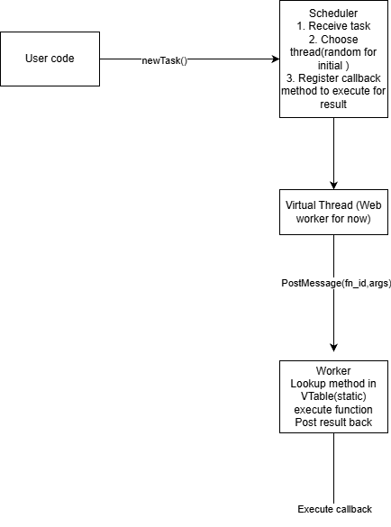

## Penny is an experiment in building a Cilk-style work-stealing scheduler for the browser using Web Workers, dynamic vtables, and user-level task scheduling.

The goal is to explore whether a runtime can support:

virtualized threads

dynamic function dispatch

dependency-driven execution

future WASM stack switching

hybrid browser-native + WASM scheduling

## This repository contains v1 of the scheduler:

a static/dynamic vtable

virtual thread abstraction

random scheduling (first slice)

callback-based task completions

Architecture notes and design decisions are documented in /docs/architecture.md and /docs/dev_thoughts.md

## Current data flow
v1.

## Roadmap
🚧 v2 Goals
- Thread state machine: Idle | Running | Blocked
- Deterministic scheduling (round-robin)
- Per-thread task deques
- Work-stealing prototype (Cilk-style)
- Basic dependency graph support (mini-DAG executor)
- Name-mangled function registry (or at least hashing and mapping function names to avoid collision)

🚧 v3 Goals
- WASM core scheduler
- WASM stack switching → shallow fibers
- pluggable thread abstraction (browser / node / wasm) (Have started abstracting early, but need to see if it holds)

🚧 v4 (vision)
- Multi-node distributed scheduling
- Serialized microtasks + atomic execution units
- Virtual global thread pool across clients
